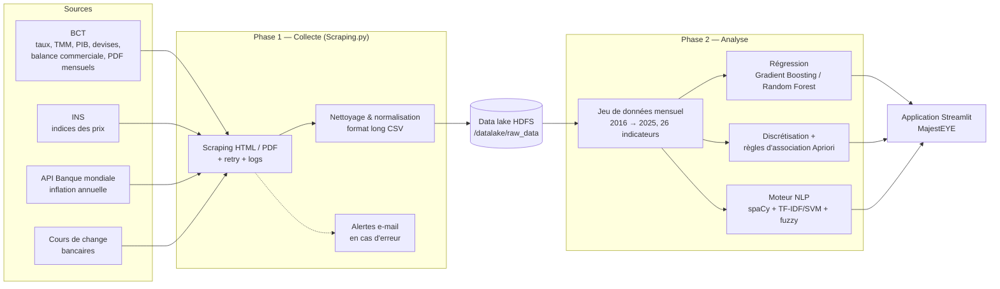

# MajestEYE — Plateforme d'analyse et de prévision de l'inflation en Tunisie

MajestEYE est une plateforme web d'analyse économique consacrée à l'inflation en Tunisie. Elle couvre toute la chaîne de traitement de la donnée : la **collecte automatique** des indicateurs publiés par les sources officielles (BCT, INS, Banque mondiale), leur **stockage** dans un data lake HDFS, leur **analyse** par apprentissage automatique et fouille de règles d'association, puis leur **restitution** dans une application Streamlit sécurisée.

L'objectif est double :

1. **Prévoir** l'inflation mensuelle (MoM, *month-over-month*) sur les mois à venir.
2. **Expliquer** l'inflation, en identifiant les combinaisons d'indicateurs économiques (PIB, masse monétaire, réserves, salaires, tourisme, saisonnalité…) qui précèdent un passage vers un niveau d'inflation élevé.

---

## Sommaire

- [Fonctionnalités](#fonctionnalités)
- [Architecture](#architecture)
- [Données](#données)
- [Méthodes et modèles](#méthodes-et-modèles)
- [Structure du dépôt](#structure-du-dépôt)
- [Installation](#installation)
- [Lancement](#lancement)
- [Configuration](#configuration)
- [Pipeline de collecte (phase 1)](#pipeline-de-collecte-phase-1)
- [Scripts d'analyse annexes](#scripts-danalyse-annexes)
- [Limites connues et pistes d'amélioration](#limites-connues-et-pistes-damélioration)
- [Auteur](#auteur)

---

## Fonctionnalités

L'application Streamlit (`streamlit/app.py`) est protégée par une page de connexion et propose les modules suivants :

| Page | Rôle |
|---|---|
| 🏠 **Accueil** | Présentation de la plateforme et de ses fonctionnalités. |
| 🧠 **NLP** | Interrogation des données en langage naturel, en français (ex. *« Quel était le taux de chômage en 2022 ? »*, *« Somme des exportations 2021 »*). La question est analysée pour en extraire l'indicateur, l'opération (valeur, moyenne, somme, médiane, min, max) et la période, puis la réponse est calculée sur le jeu de données. |
| 📈 **Prédiction** | Prévision de l'inflation mensuelle sur 1 à 9 mois (à partir d'avril 2025) avec deux modèles au choix : **Gradient Boosting** ou **Random Forest**. Affiche le tableau des prévisions et le graphique historique + prévision. |
| 🔮 **Prédicteur Inflation MoM** | Import d'un fichier `.dat` d'indicateurs discrétisés et application des règles d'association pour classer chaque mois en niveau d'inflation 2 (modéré) ou 3 (élevé). Si le niveau réel est présent dans le fichier, la précision est calculée. Les résultats sont exportables en CSV. |
| 📊 **Dashboard** | Accès au tableau de bord de visualisation externe (Skeyechart). |
| 🧩 **Facteurs Économiques** | Restitution des règles d'association découvertes (« leviers de l'inflation ») : conditions, précision, support, interprétation économique, facteurs clés et recommandations. |
| 👥 **Gestion Utilisateurs** | *(administrateurs uniquement)* Création, liste et suppression des comptes. Les mots de passe sont stockés sous forme hachée. |

---

## Architecture



---

## Données

Les jeux de données préparés se trouvent dans `streamlit/data/`.

**Période couverte :** données mensuelles de février 2016 à mars 2025 (environ 110 observations).

**Variable cible :** `inflation_mom`, l'inflation mensuelle en %.

**Indicateurs explicatifs (26)** :

| Domaine | Indicateurs |
|---|---|
| Prix | IPC global, IPC logement, IPC transport, inflation alimentaire, inflation des loyers |
| Monnaie & finance | Masse monétaire M1, M2, M3, taux d'intérêt, réserves de change, réserves d'or, dette extérieure |
| Activité | PIB, PIB à prix constants, production industrielle, production manufacturière, production minière |
| Commerce extérieur & tourisme | Exportations, importations, recettes touristiques |
| Emploi & revenus | Taux de chômage, population active occupée, salaire minimum |
| Demande | Consommation des ménages, dépenses publiques, population |

**Fichiers principaux :**

| Fichier | Contenu |
|---|---|
| `final401.parquet` | Jeu de données consolidé (valeurs brutes), utilisé par le module NLP. |
| `fichierpred.parquet` | Jeu de données utilisé pour entraîner les modèles de prévision. |
| `dis3.dat`, `dis3_cleaned.dat` | Données **discrétisées** en 3 niveaux, décalées d'un mois (`...levellagged`), au format transactionnel `variable:niveau` utilisé par Apriori. |
| `dis3_cleaned_resumed.dat` | Même contenu avec des noms de variables raccourcis (généré par `regle2.py`). |
| `skeyepredict_inflation*.dat`, `final401_discretized.dat`, `dis3_randomized_levels.dat`, … | Variantes de travail (tests de discrétisation, jeux de validation). |

**Niveaux d'inflation mensuelle (discrétisation) :**

| Niveau | Intervalle d'inflation MoM | Lecture |
|---|---|---|
| 1 | [-1,1 % ; -0,3 %) | Baisse des prix |
| 2 | [-0,3 % ; 0,6 %) | Inflation faible à modérée |
| 3 | [0,6 % ; 1,4 %] | Inflation élevée |

Exemple d'une ligne au format `.dat` :

```
id:20162,annee:2016,datetime:2016-02-29,mois:2,trimestre:1,inflationmomlevel:1,cpilevellagged:1,exportslevellagged:1,moneysupplym2levellagged:1,...
```

---

## Méthodes et modèles

### 1. Prévision de l'inflation (régression)

Deux modèles sont disponibles dans la page *Prédiction* :

**Gradient Boosting** (`modules/prediction.py`)

- Contrôle qualité des données (valeurs manquantes, colonnes trop incomplètes).
- Ajout de retards (*lags*) de 1 à 12 mois de l'inflation.
- Sélection de variables combinant corrélation, information mutuelle et importance par permutation.
- Pipeline `StandardScaler` + `GradientBoostingRegressor`, hyperparamètres optimisés par `GridSearchCV` (validation croisée à 3 plis).
- Prévision **itérative** : chaque mois prédit alimente les retards du mois suivant.

**Random Forest** (`modules/testra.py`)

- Retards de 1 à 6 mois et variables dérivées.
- `RandomForestRegressor` (150 arbres, profondeur max 12), évalué par validation croisée à 5 plis (RMSE).
- Classement des variables par importance et graphique avec intervalle de confiance.

Les modèles entraînés sont sauvegardés dans `streamlit/models/`. L'horizon de prévision commence en avril 2025 et va jusqu'à décembre 2025 au maximum (1 à 9 mois).

### 2. Leviers de l'inflation (règles d'association)

Les indicateurs sont discrétisés en 3 niveaux et **décalés d'un mois**, afin que les règles décrivent ce qui se passe *avant* un changement d'inflation. L'algorithme **Apriori** (`apriori.py`, `ss.py`) recherche ensuite les combinaisons de conditions qui mènent à un niveau d'inflation donné, en filtrant sur le support, la confiance et le lift.

Au final, **15 règles** sont retenues :

- **12 règles** vers le niveau 3 (inflation élevée), par exemple :
  - PIB à prix constants élevé le mois précédent → inflation élevée (précision ≈ 90 %, support ≈ 28 %) ;
  - recettes touristiques faibles le mois précédent → inflation élevée (≈ 90 %) ;
  - réserves d'or faibles **et** salaire minimum bas → inflation élevée (≈ 92 %) ;
  - effets saisonniers marqués en **avril** et en **octobre**.
- **3 règles** vers le niveau 2 (inflation modérée), liées aux loyers en février, à la production industrielle en mai et aux exportations en décembre.

Dans le *Prédicteur Inflation MoM*, chaque mois est évalué sur toutes les règles : les scores des règles activées sont additionnés par niveau, et le niveau au score le plus élevé est retenu. Si aucune règle n'est activée, le mois est « non classifié » (ce qui correspond en pratique au niveau 1).

### 3. Interrogation en langage naturel

Le module `modules/nlp_handler.py` transforme une question en français en requête sur les données :

- **Normalisation** du texte et analyse avec **spaCy** (`fr_core_news_sm`).
- **Détection de l'indicateur** grâce à un dictionnaire de synonymes (ex. *« hausse des prix »*, *« IPC »* → `inflation_mom`) et une correspondance approximative (**RapidFuzz**), complétée par un classifieur **TF-IDF + LinearSVC**.
- **Détection de l'opération** (valeur, moyenne, somme, médiane, minimum, maximum) et des **filtres temporels** (année, mois).
- Plusieurs questions peuvent être posées d'un coup, séparées par « et », « ou » ou une virgule.

---

## Structure du dépôt

```
ai platform/
├── README.md
├── requirements.txt
├── .env.example                  # Variables d'environnement à définir
├── .gitignore
│
├── phase 1 - Copie/              # Phase 1 : collecte et ingestion des données
│   ├── Scraping.py               # Pipeline de scraping planifié → CSV → HDFS
│   ├── Instructions_Pipeline.docx
│   ├── Guide_Pipeline.docx
│   └── Défis_Solutions.docx
│
└── streamlit/                    # Phase 2 : analyse et application web
    ├── app.py                    # Point d'entrée de l'application
    ├── .streamlit/config.toml    # Thème de l'interface
    ├── assets/                   # Logo, image de fond, CSS
    ├── data/                     # Jeux de données (parquet, .dat)
    ├── models/                   # Modèles entraînés (.pkl, .joblib)
    ├── modules/                  # Modules chargés par l'application
    │   ├── nlp_handler.py        # Moteur de questions en langage naturel
    │   ├── prediction.py         # Prévision Gradient Boosting
    │   ├── testra.py             # Prévision Random Forest
    │   └── pred.py, test.py      # Anciennes versions du module de prévision
    ├── apriori.py                # Extraction des règles d'association
    ├── ss.py                     # Version optimisée d'Apriori (3 niveaux)
    ├── streamlit_rules.py        # Application autonome de test des règles
    ├── testrules.js              # Variante du test des règles (code Python)
    ├── regle2.py                 # Raccourcissement des noms de variables (.dat)
    ├── nlp.py                    # Version console du moteur NLP
    ├── *.json                    # Résultats des analyses Apriori
    └── users.json                # Comptes utilisateurs (créé au 1er lancement)
```

---

## Installation

**Prérequis :** Python 3.10 ou plus récent (développé avec Python 3.12).

```bash
git clone https://github.com/ziedsoukni/AI-Powered-Inflation-Forecasting-Platform.git
cd AI-Powered-Inflation-Forecasting-Platform

python -m venv .venv
# Windows
.venv\Scripts\activate
# Linux / macOS
source .venv/bin/activate

pip install -r requirements.txt
python -m spacy download fr_core_news_sm
```

> Le pipeline de collecte (phase 1) nécessite en plus **Java** (pour `tabula-py`) et, si l'envoi vers le data lake est utilisé, un cluster **Hadoop HDFS** accessible (par défaut `http://localhost:9870`).

---

## Lancement

```bash
cd streamlit
streamlit run app.py
```

L'application s'ouvre sur `http://localhost:8501`.

Au premier lancement, si `users.json` n'existe pas, un compte **`admin`** est créé avec le mot de passe défini dans la variable `ADMIN_PASSWORD` (voir ci-dessous). Connectez-vous avec ce compte, puis créez les autres utilisateurs depuis **👥 Gestion Utilisateurs**.

> Lancez l'application depuis n'importe quel dossier : tous les chemins (données, modèles, images) sont calculés à partir de l'emplacement des fichiers.

---

## Configuration

Les informations sensibles ne sont pas écrites dans le code : elles sont lues depuis des variables d'environnement. Le fichier `.env.example` en donne la liste.

| Variable | Utilisée par | Rôle |
|---|---|---|
| `ADMIN_PASSWORD` | `app.py` | Mot de passe du compte `admin` créé au premier lancement. |
| `SMTP_SENDER` | `Scraping.py` | Adresse Gmail qui envoie les alertes. |
| `SMTP_RECEIVER` | `Scraping.py` | Adresse qui reçoit les alertes. |
| `SMTP_APP_PASSWORD` | `Scraping.py` | Mot de passe d'application Gmail. |

Exemple sous Windows (PowerShell) :

```powershell
$env:ADMIN_PASSWORD = "un-mot-de-passe-solide"
streamlit run app.py
```

Sous Linux / macOS :

```bash
export ADMIN_PASSWORD="un-mot-de-passe-solide"
streamlit run app.py
```

Le thème de l'interface se règle dans `streamlit/.streamlit/config.toml`.

---

## Pipeline de collecte (phase 1)

`phase 1 - Copie/Scraping.py` automatise la récupération des données économiques :

| Source | Données | Fréquence |
|---|---|---|
| Banque Centrale de Tunisie (BCT) | Taux d'intérêt, TMM, PIB, cours annuels des devises | Mensuelle |
| BCT | Exportations et importations | Annuelle |
| BCT (PDF « Situation mensuelle ») | Tableaux extraits avec `pdfplumber` / `tabula` | À la demande |
| Institut National de la Statistique (INS) | Indices des prix | Mensuelle |
| Cours de change bancaires | Taux de change du jour | Quotidienne |
| API Banque mondiale | Inflation annuelle de la Tunisie | Annuelle |

**Fonctionnement :**

1. **Extraction** des tableaux HTML (BeautifulSoup) et PDF, avec nouvelle tentative automatique en cas d'échec (`tenacity`).
2. **Transformation** : nettoyage des valeurs, conversion numérique, passage au format long et normalisation des CSV.
3. **Chargement** des CSV dans HDFS (`/datalake/raw_data/`).
4. **Planification** avec `schedule` : les tâches s'exécutent chaque jour à 02:07 et vérifient elles-mêmes si elles doivent tourner (tâches quotidiennes, mensuelles ou annuelles).
5. **Suivi** : journal dans `pipeline.log` et alerte e-mail regroupant les erreurs d'une exécution.

**Lancement :**

```bash
cd "phase 1 - Copie"
python Scraping.py
```

Les dossiers de travail sont définis en haut du script (`C:\Users\user\Documents\data` pour les fichiers bruts, `C:\Users\user\Documents\datascript` pour les fichiers transformés et les logs) ; adaptez-les à votre machine. Les documents Word du dossier détaillent l'installation, la maintenance et les problèmes rencontrés.

---

## Scripts d'analyse annexes

Ces scripts ont servi à produire les règles et les modèles utilisés par l'application. Ils se lancent indépendamment depuis le dossier `streamlit/`.

| Script | Rôle |
|---|---|
| `apriori.py` | Analyseur Apriori complet (support, confiance, lift, jusqu'à 5 antécédents) ; produit `apriori_results_rules.json` et `apriori_results_formulas.json`. |
| `ss.py` | Version optimisée pour 3 niveaux d'inflation, limitée aux meilleures règles ; produit `super_optimized_results.json`. |
| `streamlit_rules.py` | Mini-application Streamlit pour tester les règles sur un fichier `.dat` (`streamlit run streamlit_rules.py`). |
| `regle2.py` | Raccourcit les noms de variables d'un fichier `.dat`. |
| `nlp.py` | Version en ligne de commande du moteur NLP. |

---

## Limites connues et pistes d'amélioration

- **Taille des données** : environ 110 observations mensuelles ; les performances des modèles doivent être lues avec prudence, et une validation temporelle (*walk-forward*) serait plus fiable qu'une validation croisée classique.
- **Indicateurs de l'interface** : certaines valeurs affichées dans les pages (nombre d'analyses, temps de réponse, précision globale, etc.) sont des valeurs de présentation fixes, et non des mesures calculées en direct.
- **Horizon de prévision** figé sur l'année 2025 (d'avril à décembre) ; à rendre dynamique en fonction de la dernière date disponible.
- **Authentification** : les mots de passe sont hachés en SHA-256 sans sel ; passer à `bcrypt` ou `argon2` renforcerait la sécurité.
- **Pipeline** : les chemins de travail sont encore propres à une machine Windows ; ils pourraient être centralisés dans un fichier de configuration.
- **Nettoyage du dépôt** : les anciennes versions (`modules/pred.py`, `modules/test.py`, `backupapp.txt`) et les modèles en double pourraient être archivés.

---

## Auteur

**Zied Soukni** — [github.com/ziedsoukni](https://github.com/ziedsoukni)
